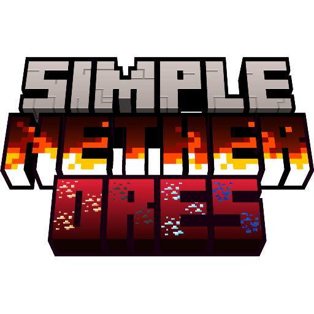

<table  align="center">
	<tbody>
		<tr>
			<td width="280px" style="text-align: center;"></td>		
			<td>
				<h2 align="left">Simple Nether Ores</h2>
				
<b>for Minecraft Beta 1.7.3</b>

				
				
Simple mod that adds more ores into the Nether dimension for Minecraft beta 1.7.3 (for StAPI)

			</td>		
		</tr>
	</tbody>
</table>

**Ores List:**
- Coal Ore (drops 1 coal)
- Iron Ore (drops itself, smelts into iron ingot)
- Gold Ore (drops itself, smelts into gold ingot)
- Diamond Ore (drops 1 diamond)
- Redstone Ore (drops 1-5 redstone)
- Glowstone Ore (drops 2-4 glowstone)
- Lapis Ore (drops 3-6 lapis)